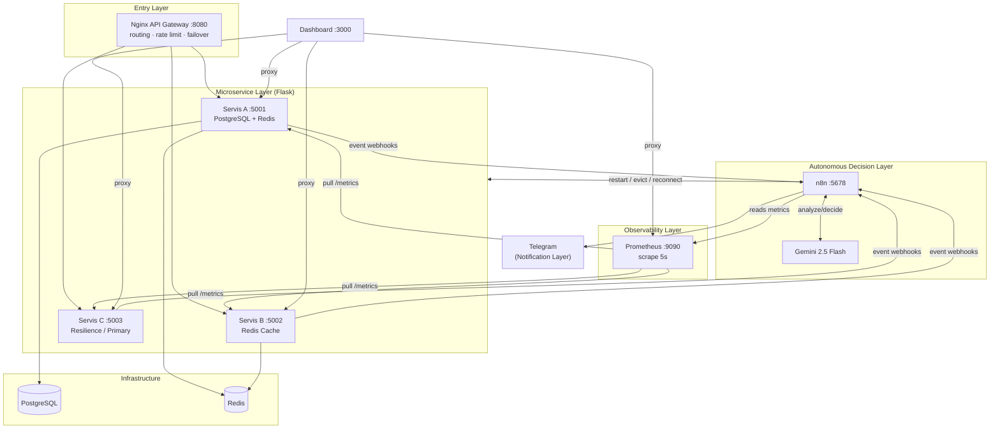

# Autonomous Microservice Orchestrator & Self-Healing System Network

**Language / Dil:** [English](#english) · [Türkçe](#türkçe)

<a id="english"></a>

An end-to-end, AI-driven microservice platform that **detects, diagnoses, and repairs its own faults** without human intervention. Prometheus observes the services, an **n8n + Google Gemini 2.5 Flash** decision layer reasons over the metrics and logs, and remediation actions (container restart, cache eviction, database reconnect, traffic failover) are applied automatically — each incident reported to Telegram as an explainable report.

> Graduation design project. The system combines **Chaos Engineering**, **Observability (AIOps)**, **LLM-based autonomous decision-making**, and **Self-Healing** into a single, runnable demo stack of nine containers.

---

## Table of Contents

- [Key Features](#key-features)
- [Architecture](#architecture)
- [Technology Stack](#technology-stack)
- [Repository Structure](#repository-structure)
- [Getting Started](#getting-started)
- [Configuration (Secrets)](#configuration-secrets)
- [Usage & Endpoints](#usage--endpoints)
- [Chaos Scenarios](#chaos-scenarios)
- [How Autonomous Recovery Works](#how-autonomous-recovery-works)
- [n8n Workflows](#n8n-workflows)
- [Predictive Maintenance](#predictive-maintenance)
- [Testing](#testing)
- [Security Notes](#security-notes)
- [Future Work](#future-work)

---

## Key Features

- **Self-Healing:** Autonomous recovery for service crashes, memory leaks, database disconnects, cache floods, and high latency.
- **LLM Decision Layer:** Google Gemini 2.5 Flash (via a LangChain Agent in n8n) selects and executes tools instead of relying on static rules.
- **Predictive Maintenance:** OLS linear regression over RAM trends forecasts failures *before* they happen (slope, 2-minute forecast, R² confidence, ETA to threshold).
- **Automatic Failover:** Nginx routes `/islem` to a primary service and transparently fails over to a backup on error — zero user-visible downtime.
- **Explainable Alerts:** Every autonomous action is reported to Telegram with root cause and applied action.
- **Resilient by Design:** Notification/recovery flows still fire even if the LLM API is rate-limited.
- **Chaos Engineering:** Built-in fault-injection endpoints to demonstrate resilience on demand.

---

## Architecture

Five logical layers across nine containers:



| Layer | Component | Role |
|-------|-----------|------|
| Entry | Nginx Gateway | Single entry point, routing, rate limiting, failover, dynamic DNS |
| Microservices | Servis A / B / C (Flask) | Database, cache, and resilience/primary services |
| Infrastructure | PostgreSQL, Redis | Persistent storage and in-memory cache |
| Observability | Prometheus | Time-series metric collection (pull model) |
| Decision | n8n + Gemini 2.5 Flash | Metric analysis and autonomous remediation |
| Notification | Telegram Bot | Real-time, explainable incident reports |

---

## Technology Stack

| Technology | Usage in this project |
|-----------|------------------------|
| **Docker & Docker Compose** | Packaging and orchestrating nine containers on a shared network |
| **Flask (Python)** | Three microservices from a single codebase (`SERVICE_NAME` env selects identity) |
| **PostgreSQL** | Persistent store for Servis A (with a retention policy) |
| **Redis** | In-memory cache for Servis B and Servis A read-through cache |
| **Nginx** | API gateway: routing, rate limiting (20 r/s), `/islem` failover, dynamic DNS resolver |
| **Prometheus** | Scrapes `/metrics` every 5 seconds; feeds the decision layer |
| **n8n** | Node-based automation: one scheduled orchestrator + four event-driven workflows |
| **Google Gemini 2.5 Flash** | LLM agent (LangChain) that reasons and calls tools (`get_logs`, `restart_service`, `cache_evict`) |
| **Telegram Bot API** | Delivers AI-generated incident reports |

---

## Repository Structure

```
.
├── app.py                  # Unified Flask app for Servis A / B / C
├── Dockerfile              # Image for the microservices
├── docker-compose.yml      # 9-service stack definition
├── requirements.txt        # Python dependencies
├── nginx.conf              # API gateway config (routing, rate limit, failover)
├── prometheus.yml          # Prometheus scrape config
├── dashboard/              # Static control panel (Nginx + HTML/Tailwind) → :3000
│   ├── Dockerfile
│   ├── index.html
│   └── nginx.conf
├── scripts/                # n8n workflow definitions & helper scripts
│   ├── build_otonom_workflow.py
│   ├── db_uyari_workflow.json
│   ├── db_baglanti_workflow.json
│   ├── cache_uyari_workflow.json
│   ├── latency_uyari_workflow.json
│   ├── fix_webhook_resilient.py
│   └── chaos_test.py
└── workflow_yeni.json      # Main orchestrator workflow definition
```

> **Not included (by design):** `n8n_data/` (runtime DB with credentials), virtual environments, and any file containing API keys or tokens. See [Security Notes](#security-notes).

---

## Getting Started

### Prerequisites

- Docker & Docker Compose
- A Google Gemini API key (Google AI Studio)
- A Telegram bot token and chat ID (via [@BotFather](https://t.me/BotFather))

### Run

```bash
# 1. Build and start the whole stack
docker compose up -d --build

# 2. Verify containers are healthy
docker compose ps
```

Once running, open:

| Service | URL |
|---------|-----|
| Control Dashboard | http://localhost:3000 |
| Nginx API Gateway | http://localhost:8080 |
| Prometheus | http://localhost:9090 |
| n8n Editor | http://localhost:5678 |
| Servis A / B / C panels | http://localhost:5001 · :5002 · :5003 |

---

## Configuration (Secrets)

This project needs two secrets that are **not** stored in the repository. Configure them inside the n8n editor after the stack starts:

1. **Google Gemini API key** — n8n → *Credentials* → *Google Gemini (PaLM) API* → paste your key.
2. **Telegram Bot** — n8n → *Credentials* → *Telegram* → paste your bot token; set your chat ID in the Telegram nodes.

Import the workflow definitions from `scripts/*.json` and `workflow_yeni.json` into n8n, then activate them.

---

## Usage & Endpoints

Each microservice exposes standardized endpoints:

| Endpoint | Purpose |
|----------|---------|
| `/health` | Health check |
| `/metrics` | Prometheus metrics |
| `/api/status` | Live status snapshot |

Prometheus metrics of interest:

- `process_resident_memory_bytes` — RAM usage
- `up` — service reachability (1/0)
- `servis_a_db_up` — PostgreSQL connection state
- `servis_avg_latency_ms` — average response latency
- `servis_ram_egim_mb_dk`, `servis_ram_trend_guven`, `servis_ram_tahmin_mb` — RAM trend/forecast metrics

---

## Chaos Scenarios

Fault-injection endpoints (also available as buttons on the dashboards):

| Scenario | Endpoint | Effect |
|----------|----------|--------|
| Memory leak | `/leak?mb=100` | Gradually inflates RAM |
| CPU stress | `/cpu-stres` | Loads the CPU (self-expires after 30s) |
| Latency | `/latency-stres` | Adds +100 ms (300 ms → warn, 600 ms → restart) |
| Crash | `/boz` | Kills the process (`up=0`) |
| DB disconnect | `/db/disconnect` | Simulates a PostgreSQL outage |
| Cache flood | `/cache/flood` | Fills Redis with thousands of keys |

---

## How Autonomous Recovery Works

The system implements an **OODA loop**:

1. **Observe** — Prometheus collects metrics every 5 seconds.
2. **Orient** — Gemini reads logs and determines the root cause.
3. **Decide** — Gemini selects the appropriate tool.
4. **Act** — A Docker command is executed and a Telegram report is sent.

Two timing paths:

- **Instant (webhooks):** DB disconnect, cache flood, and latency events trigger n8n within seconds.
- **Periodic (orchestrator):** RAM, CPU, and crash (`up=0`) are caught by the scheduled orchestrator (runs every minute).

---

## n8n Workflows

| # | Workflow | Trigger | Responsibility |
|---|----------|---------|----------------|
| 1 | Autonomous Orchestrator | Scheduled (1 min) | General health sweep + remediation |
| 2 | Servis A DB Warning | Webhook | Record-count / capacity threshold |
| 3 | Servis A DB Connection | Webhook | Disconnect detection + auto-reconnect |
| 4 | Servis B Cache Warning | Webhook | Cache flood + auto-eviction |
| 5 | Servis C Latency | Webhook | High latency + restart |

Each webhook workflow is **resilient to LLM failure**: if Gemini is unavailable (e.g., rate-limited), a fallback node still sends the Telegram notification and runs the recovery action.

---

## Predictive Maintenance

Rather than only reacting to failures, the system forecasts them. Each service keeps ~3 minutes of RAM samples and applies **Ordinary Least Squares (OLS) linear regression** to compute:

- **Slope** (MB/min) — growth rate
- **2-minute forecast** — projected RAM
- **R²** — confidence of the trend
- **ETA** — time until the critical threshold (250 MB)

Gemini interprets these to raise an early warning *before* a crash occurs (i.e., predictive maintenance).

---

## Testing

An automated chaos test triggers faults and measures recovery time:

```bash
python scripts/chaos_test.py
```

---

## Security Notes

- **Never commit secrets.** API keys and Telegram tokens live only in n8n credentials / the n8n runtime database, which is git-ignored.
- The n8n container mounts the Docker socket to enable autonomous container control. This is intentional for a demo; in production, replace it with a scoped, least-privilege control API.
- `.gitignore` excludes runtime data, virtual environments, backups, and export files that may contain credentials.

---

## Future Work

- Multi-LLM redundancy (fallback model when the primary is unavailable)
- Autonomous scaling (replica increase under load)
- Advanced forecasting (ARIMA / LSTM)
- Network-layer chaos (packet loss, partitions)
- Cloud deployment

---

---

<a id="türkçe"></a>

# Otonom Mikroservis Orkestratörü ve Kendi Kendini İyileştiren Sistem Ağı

**Language / Dil:** [English](#english) · [Türkçe](#türkçe)

Uçtan uca, yapay zeka destekli bir mikroservis platformu: **kendi arızalarını kendisi tespit eder, teşhis eder ve onarır** — insan müdahalesi olmadan. Prometheus servisleri izler, **n8n + Google Gemini 2.5 Flash** karar katmanı metrikler ve loglar üzerinde akıl yürütür; onarım aksiyonları (konteyner yeniden başlatma, önbellek temizleme, veritabanı yeniden bağlanma, trafik yönlendirme) otomatik uygulanır ve her olay Telegram'a açıklanabilir bir rapor olarak iletilir.

> Bitirme tasarım projesi. Sistem; **Kaos Mühendisliği**, **Gözlemlenebilirlik (AIOps)**, **LLM tabanlı otonom karar verme** ve **Kendi Kendini İyileştirme** kavramlarını tek ve çalıştırılabilir bir demo yığınında (dokuz konteyner) birleştirir.

## Öne Çıkan Özellikler

- **Kendi Kendini İyileştirme:** Servis çökmesi, bellek sızıntısı, veritabanı kopması, önbellek şişmesi ve yüksek gecikme için otonom kurtarma.
- **LLM Karar Katmanı:** Google Gemini 2.5 Flash (n8n içinde LangChain Agent) statik kurallar yerine araç seçip çalıştırır.
- **Proaktif Bakım:** RAM eğilimi üzerinde OLS doğrusal regresyon ile arızayı *oluşmadan önce* öngörür (eğim, 2 dakikalık tahmin, R² güven, kritik eşiğe ETA).
- **Otomatik Failover:** Nginx `/islem` isteğini birincil servise yönlendirir, hata durumunda yedeğe şeffafça geçer — kullanıcı kesinti görmez.
- **Açıklanabilir Uyarılar:** Her otonom aksiyon, kök neden ve uygulanan işlemle Telegram'a raporlanır.
- **Dayanıklı Tasarım:** LLM API'si limitlenip hata verse bile bildirim/kurtarma akışları yine çalışır.
- **Kaos Mühendisliği:** Dayanıklılığı talep üzerine göstermek için gömülü arıza-enjeksiyon uçları.

## Mimari

Dokuz konteyner üzerinde beş mantıksal katman:

| Katman | Bileşen | Görev |
|--------|---------|-------|
| Giriş | Nginx Gateway | Tek giriş noktası, yönlendirme, hız sınırlama, failover, dinamik DNS |
| Mikroservis | Servis A / B / C (Flask) | Veritabanı, önbellek ve dayanıklılık/birincil servisler |
| Altyapı | PostgreSQL, Redis | Kalıcı depolama ve bellek-içi önbellek |
| Gözlemlenebilirlik | Prometheus | Zaman-serisi metrik toplama (pull modeli) |
| Karar | n8n + Gemini 2.5 Flash | Metrik analizi ve otonom onarım |
| Bildirim | Telegram Bot | Gerçek zamanlı, açıklanabilir olay raporları |

## Teknoloji Yığını

| Teknoloji | Projedeki Kullanımı |
|-----------|---------------------|
| **Docker & Docker Compose** | Dokuz konteynerin paketlenmesi ve ortak ağda orkestrasyonu |
| **Flask (Python)** | Tek koddan üç mikroservis (`SERVICE_NAME` kimliği seçer) |
| **PostgreSQL** | Servis A için kalıcı depo (saklama politikası ile) |
| **Redis** | Servis B için önbellek ve Servis A okuma önbelleği |
| **Nginx** | API ağ geçidi: yönlendirme, hız sınırı (20 r/s), `/islem` failover, dinamik DNS |
| **Prometheus** | `/metrics` uçlarını 5 saniyede bir çeker; karar katmanını besler |
| **n8n** | Bir zamanlanmış orkestratör + dört olay-tetiklemeli iş akışı |
| **Google Gemini 2.5 Flash** | Akıl yürüten ve araç çağıran LLM ajanı (`get_logs`, `restart_service`, `cache_evict`) |
| **Telegram Bot API** | Yapay zekânın ürettiği olay raporlarını iletir |

## Kurulum

**Gereksinimler:** Docker & Docker Compose, Google Gemini API anahtarı, Telegram bot token'ı ve chat ID.

```bash
# 1. Tüm yığını derle ve başlat
docker compose up -d --build

# 2. Konteynerleri doğrula
docker compose ps
```

| Servis | Adres |
|--------|-------|
| Kontrol Paneli | http://localhost:3000 |
| Nginx API Gateway | http://localhost:8080 |
| Prometheus | http://localhost:9090 |
| n8n Editörü | http://localhost:5678 |
| Servis A / B / C | http://localhost:5001 · :5002 · :5003 |

## Gizli Anahtarların Ayarlanması

İki gizli değer depoda **saklanmaz**; yığın açıldıktan sonra n8n editöründe tanımlanır:

1. **Google Gemini API anahtarı** — n8n → *Credentials* → *Google Gemini (PaLM) API* → anahtarını yapıştır.
2. **Telegram Bot** — n8n → *Credentials* → *Telegram* → bot token'ını yapıştır; Telegram düğümlerinde chat ID'ni ayarla.

Ardından `scripts/*.json` ve `workflow_yeni.json` içindeki iş akışlarını n8n'e içe aktarıp etkinleştir.

## Kaos Senaryoları

| Senaryo | Uç | Etki |
|---------|-----|------|
| Bellek sızıntısı | `/leak?mb=100` | RAM'i kademeli şişirir |
| CPU stresi | `/cpu-stres` | CPU'yu yükler (30 sn sonra kendiliğinden biter) |
| Gecikme | `/latency-stres` | +100 ms ekler (300 ms → uyarı, 600 ms → restart) |
| Çökme | `/boz` | Süreci öldürür (`up=0`) |
| DB kopması | `/db/disconnect` | PostgreSQL kesintisini simüle eder |
| Önbellek şişmesi | `/cache/flood` | Redis'i binlerce anahtarla doldurur |

## Otonom Kurtarma Nasıl Çalışır (OODA Döngüsü)

1. **Gözlem (Observe):** Prometheus her 5 saniyede metrik toplar.
2. **Yönelim (Orient):** Gemini logları okuyup kök nedeni belirler.
3. **Karar (Decide):** Gemini uygun aracı seçer.
4. **Aksiyon (Act):** Docker komutu çalıştırılır ve Telegram raporu gönderilir.

İki zamanlama yolu: **Anlık (webhook)** — DB kopması, önbellek şişmesi, gecikme saniyeler içinde tetiklenir. **Periyodik (orkestratör)** — RAM, CPU ve çökme (`up=0`) dakikada bir çalışan zamanlanmış akışla yakalanır.

## n8n İş Akışları

| # | İş Akışı | Tetikleyici | Sorumluluk |
|---|----------|-------------|------------|
| 1 | Otonom Orkestratör | Zamanlanmış (1 dk) | Genel sağlık taraması + onarım |
| 2 | Servis A DB Uyarı | Webhook | Kayıt sayısı / kapasite eşiği |
| 3 | Servis A DB Bağlantı | Webhook | Kopma tespiti + otomatik yeniden bağlanma |
| 4 | Servis B Önbellek Uyarı | Webhook | Önbellek şişmesi + otomatik temizleme |
| 5 | Servis C Gecikme | Webhook | Yüksek gecikme + restart |

Her webhook akışı **LLM hatasına dayanıklıdır**: Gemini ulaşılamazsa (ör. limit) bir yedek düğüm yine de Telegram bildirimini gönderir ve kurtarma aksiyonunu çalıştırır.

## Proaktif Bakım (Tahmin)

Sistem yalnızca tepki vermez, arızayı öngörür. Her servis ~3 dakikalık RAM örneği tutar ve **En Küçük Kareler (OLS) doğrusal regresyonu** ile şunları hesaplar: **Eğim** (MB/dk), **2 dk sonrası tahmin**, **R²** (güven) ve kritik eşiğe (250 MB) **ETA**. Gemini bu değerleri yorumlayarak çökmeden önce erken uyarı verir.

## Test

```bash
python scripts/chaos_test.py
```

## Güvenlik Notları

- n8n konteyneri, otonom konteyner kontrolü için Docker soketini bağlar. Demo için bilinçli bir tercihtir; üretimde en-az-yetki prensibiyle kapsamı daraltılmış bir kontrol API'si ile değiştirin.
- `.gitignore`, çalışma zamanı verisini, sanal ortamları, yedekleri ve kimlik bilgisi içerebilecek export dosyalarını dışlar.


---

## License

Released under the MIT License. See `LICENSE` for details.
